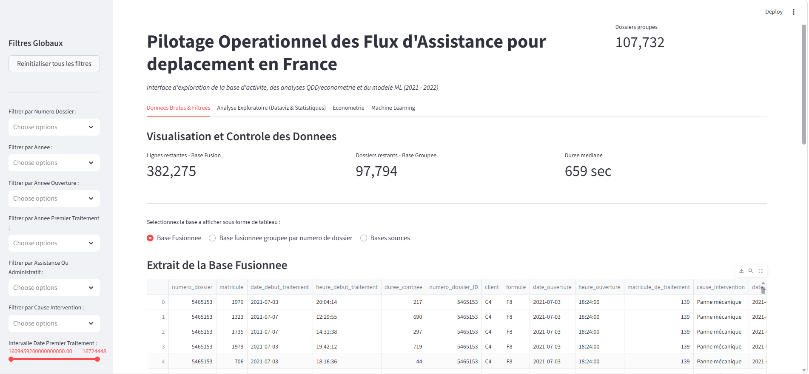
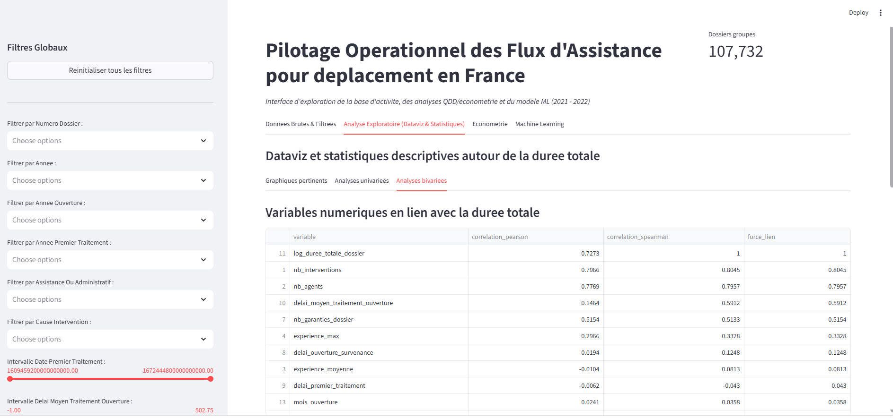
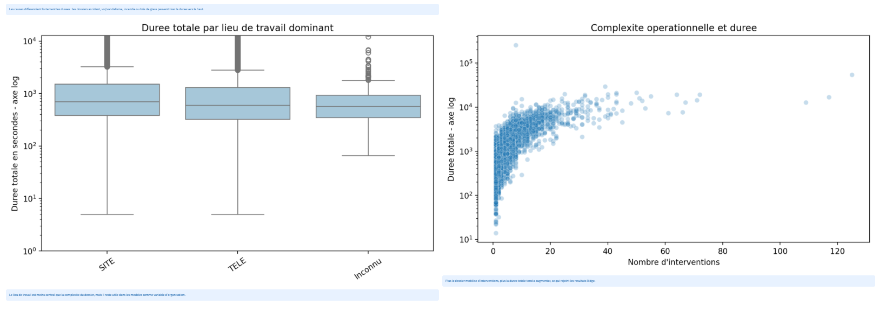
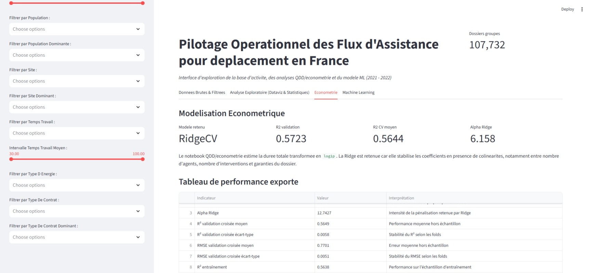
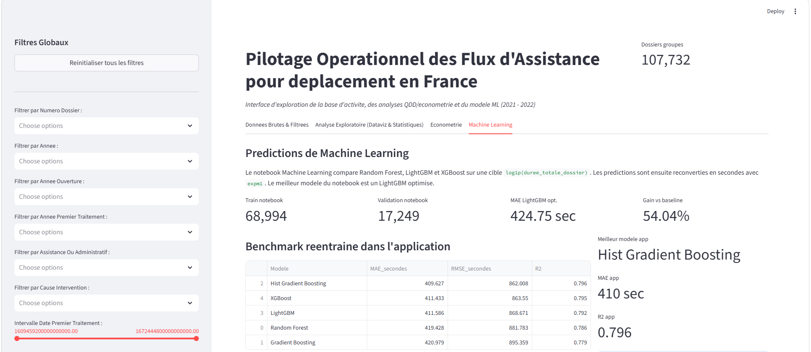

# 📊 Portfolio DataViz — Analyse, visualisation et modélisation des données

## 📌 Présentation du projet

**Portfolio DataViz** est un projet d'analyse de données développé en Python autour de la **préparation des données, de l'analyse exploratoire, de la visualisation interactive et de la modélisation statistique et prédictive**.

Le projet intègre une interface interactive développée avec **Streamlit**, permettant d'explorer les données, de visualiser différents indicateurs et d'évaluer les performances de modèles prédictifs.

L'objectif est de mettre en œuvre une démarche complète de Data Analysis et Data Science, depuis la préparation des données jusqu'à la restitution des résultats dans une interface accessible.

---

## 🎯 Objectifs

Le projet poursuit plusieurs objectifs :

* explorer et comprendre les données disponibles ;
* préparer et structurer les données pour l'analyse ;
* produire des statistiques descriptives ;
* identifier les principales tendances et relations entre les variables ;
* créer des visualisations permettant de faciliter l'interprétation des données ;
* construire et évaluer des modèles prédictifs ;
* analyser les performances des modèles ;
* présenter les résultats dans une interface interactive ;
* développer une démarche reproductible d'analyse de données.

---

## 🔎 Démarche analytique

Le projet est organisé autour de plusieurs étapes.

### 1. Préparation des données

Les données sont préparées avant leur utilisation dans les analyses et les modèles.

Cette étape comprend notamment :

* contrôle de la structure des données ;
* traitement des valeurs manquantes ;
* préparation des variables ;
* transformation des variables catégorielles ;
* standardisation lorsque nécessaire ;
* séparation des données destinées à l'entraînement et à l'évaluation des modèles.

---

### 2. Analyse exploratoire

L'analyse exploratoire permet d'étudier les principales caractéristiques des données à travers :

* des statistiques descriptives ;
* l'analyse de la distribution des variables ;
* l'étude des relations entre variables ;
* des représentations graphiques ;
* l'identification de tendances et de différences entre groupes.

Les visualisations sont produites notamment avec **Matplotlib** et **Seaborn**.

---

### 3. Modélisation

Le projet utilise plusieurs outils de l'écosystème **Scikit-learn** pour construire et évaluer des modèles prédictifs.

Le code intègre notamment :

* `train_test_split` pour la séparation des données ;
* `Pipeline` pour organiser les étapes de traitement et de modélisation ;
* `ColumnTransformer` pour appliquer différents traitements aux variables ;
* `SimpleImputer` pour le traitement des valeurs manquantes ;
* `OrdinalEncoder` pour l'encodage de variables catégorielles ;
* `StandardScaler` pour la standardisation ;
* des modèles d'ensemble et de machine learning.

Une **régression Ridge** est également utilisée dans le projet pour analyser les relations entre les variables et produire des coefficients régularisés.

Les coefficients obtenus sont disponibles dans :

```text
coefficients_ridge.csv
```

---

## 📊 Évaluation des modèles

Les performances des modèles sont évaluées à partir de plusieurs indicateurs, notamment :

* **MAE — Mean Absolute Error**
* **MSE — Mean Squared Error**
* **R² — Coefficient de détermination**

Ces indicateurs permettent de comparer les performances des modèles et d'apprécier leur capacité à expliquer ou prédire la variable étudiée.

Les résultats finaux sont également disponibles dans :

```text
tableau_performance_final_modele_ridge.xlsx
```

---

# 🖥️ Interface interactive

L'application est développée avec Streamlit.

Elle permet de regrouper dans une même interface :

* l'exploration des données ;
* les visualisations ;
* les indicateurs statistiques ;
* les résultats des modèles ;
* l'analyse des performances.

Le fichier principal de l'application est :

```text
code_interface_dataviz.py
```

---

# 🖥️ Aperçu de l'application

L'application Streamlit propose plusieurs espaces d'analyse permettant d'explorer les données, de visualiser les principales statistiques et d'interpréter les résultats des modèles.

## 📊 Analyse exploratoire

L'interface permet notamment d'étudier les relations entre les variables numériques et qualitatives, ainsi que les principaux résultats des tests statistiques.

### Présentation de l'interface de l'application



### Statistiques descriptives




### Econométrie



### Prédiction avec Machine learning 



> Les autres captures d'écran de l'application sont disponibles dans le dossier [`captures/`](captures/).


# 🛠️ Technologies utilisées

| Technologie      | Utilisation                               |
| ---------------- | ----------------------------------------- |
| **Python**       | Langage principal                         |
| **Pandas**       | Manipulation et analyse des données       |
| **NumPy**        | Calcul numérique                          |
| **Matplotlib**   | Visualisation                             |
| **Seaborn**      | Visualisation statistique                 |
| **SciPy**        | Calculs scientifiques                     |
| **Scikit-learn** | Prétraitement, modélisation et évaluation |
| **Streamlit**    | Interface interactive                     |
| **OpenPyXL**     | Manipulation des fichiers Excel           |
| **Joblib**       | Sauvegarde et chargement de modèles       |
| **LightGBM**     | Modélisation par gradient boosting        |
| **XGBoost**      | Modélisation par gradient boosting        |
| **Git / GitHub** | Gestion et versionnement du projet        |

---

# 📁 Structure du projet

```text
portfolio_dataviz/
│
├── 📁 captures
│   ├── 01_accueil.png
│   └── 02_analyse_exploratoire_1.png
│   └── 06_econometrie_1.png
│   └── 09_machine_learning_1.png
│
├── 📄 README.md
├── 📄 code_interface_dataviz.py
├── 📄 coefficients_ridge.csv
├── 📄 requirements.txt
├── 📄 tableau_performance_final_modele_ridge.xlsx
└── 📄 .gitignore
```

Les fichiers CSV volumineux sont volontairement exclus du dépôt GitHub grâce au fichier `.gitignore`.

Ils restent disponibles dans l'environnement local nécessaire à l'exécution complète du projet.

---

# ⚙️ Installation

## 1. Cloner le dépôt

```bash
git clone https://github.com/Sam0621-git/portfolio_dataviz.git
```

Puis :

```bash
cd portfolio_dataviz
```

---

## 2. Créer un environnement virtuel

Sous Windows :

```powershell
python -m venv .venv
```

Activer l'environnement :

```powershell
.\.venv\Scripts\Activate.ps1
```

---

## 3. Installer les dépendances

```powershell
pip install -r requirements.txt
```

Les principales bibliothèques nécessaires sont installées automatiquement à partir de `requirements.txt`.

---

# ▶️ Lancer l'application

Une fois l'environnement virtuel activé et les dépendances installées, lancer :

```powershell
streamlit run code_interface_dataviz.py
```

Streamlit démarre alors l'application et fournit généralement une adresse locale permettant de l'ouvrir dans un navigateur.

Par défaut, l'application est accessible à l'adresse :

```text
http://localhost:8501
```

---

# 📈 Résultats

Le projet permet de produire une synthèse visuelle et quantitative des données étudiées.

Les résultats comprennent notamment :

* statistiques descriptives ;
* visualisations exploratoires ;
* analyses des relations entre variables ;
* coefficients du modèle Ridge ;
* indicateurs de performance des modèles ;
* comparaisons entre résultats observés et prédits.

Le fichier :

```text
tableau_performance_final_modele_ridge.xlsx
```

regroupe une partie des résultats de performance du modèle.

---

# 🔐 Gestion des données

Les fichiers de données volumineux ne sont pas publiés dans ce dépôt GitHub.

Cette organisation permet notamment :

* de conserver un dépôt léger ;
* d'éviter de versionner inutilement de gros fichiers ;
* de séparer le code des données brutes ;
* de faciliter la maintenance du projet ;
* de respecter les éventuelles contraintes liées à la diffusion des données.

Le fichier `.gitignore` permet de maintenir ces fichiers uniquement dans l'environnement local.

---

# 🚀 Perspectives d'amélioration

Plusieurs évolutions peuvent être envisagées :

* enrichissement des visualisations interactives ;
* ajout de nouveaux indicateurs statistiques ;
* comparaison systématique de plusieurs algorithmes ;
* optimisation des hyperparamètres ;
* amélioration de l'expérience utilisateur de l'application ;
* automatisation du pipeline de préparation des données ;
* ajout de contrôles supplémentaires sur la qualité des données ;
* déploiement de l'application Streamlit sur une plateforme cloud ;
* ajout de captures d'écran et d'une démonstration de l'application.

---

# 👤 À propos

## Samson Odilon YEHOUENOU

**Statisticien | Data Analyst | Analyse et évaluation de projets et programmes**

Ce portfolio illustre une démarche combinant :

* statistique ;
* analyse de données ;
* visualisation ;
* modélisation prédictive ;
* programmation Python ;
* communication des résultats.

L'objectif est de transformer des données en informations utiles à l'analyse, à l'interprétation et à la prise de décision.

---

# 📫 Contact

Pour toute information concernant le projet, les méthodes utilisées ou une collaboration autour de projets d'analyse statistique et de données, vous pouvez me contacter par les canaux ci-après :

- [💼 LinkedIn](www.linkedin.com/in/samson-yehouenou)·
- [💻 GitHub](https://github.com/Sam0621-git)
- ✉️ `odilonyehouenou2@gmail.com`

---

# 📄 Licence

Projet réalisé dans le cadre d'un portfolio personnel.

Les conditions de réutilisation du code, des données et des résultats peuvent être précisées ultérieurement.
